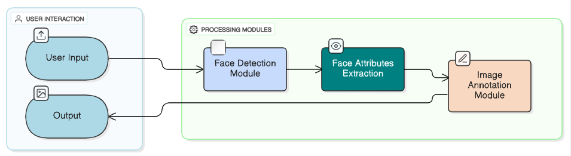

# Face Analyzer – AI Computer Vision with Azure Face SDK

## 📑 Table of Contents

- [Project Overview](#-project-overview)
- [Folder Structure & Code Description](#-folder-structure--code-description)
- [Setup & Usage](#-setup--usage)
- [Screenshots](#-screenshots)
- [Future Enhancements](#-future-enhancements)
- [Deployment Notes](#-deployment-notes-azure-app-service)
- [References](#-references)

## 📌 Project Overview

This project is a modular facial analysis application using the Azure Face SDK.
It detects faces, extracts facial attributes (yaw, occlusion, accessories), and annotates images.



**Features:**

- Modular Python code for easy extension
- Local console-based detection
- Browser-based UI using Streamlit
- Multi-image upload and annotated image download

This project is based on MS Learn AI Vision lab but enhanced for modularity and production-ready patterns.

## 📂 Folder Structure & Code Description

```
Computer-Vision-Face-Analyzer/
├── src/
│   ├── __init__.py                  # Marks src as a Python package
│   ├── config.py                    # Handles configuration (Azure endpoint & key or Key Vault)
│   ├── face_client_wrapper.py       # Wrapper to create FaceClient instance
│   ├── detector.py                  # Core face detection logic
│   ├── annotator.py                 # Image annotation (file and in-memory)
│   └── main.py                      # Console entry point for testing
├── images/                          # Sample images for testing (from MS Learn labs)
├── Detected Faces Output/           # Annotated images generated during testing
├── flow-diagram/                    # Architecture / flow diagrams
│   └── face_analyzer_architecture.png
├── Screenshots/                     # Screenshots of UI and output
├── face_api_ui.py                   # Streamlit UI for browser-based interaction
├── requirements.txt                 # Python dependencies
├── .env (optional)                  # Local secrets (replace with Key Vault in production)
└── README.md                        # Project documentation
```

### Code Details

- **config.py** – Loads configuration values (FACE_ENDPOINT, FACE_KEY) or fetches from Azure Key Vault.
- **face_client_wrapper.py** – Creates and returns a FaceClient instance.
- **detector.py** – Detects faces using Azure Face SDK and returns detected face objects.
- **annotator.py** – Annotates images with bounding boxes and facial attributes.
- **main.py** – CLI entry point for detecting faces in single images.
- **face_api_ui.py** – Streamlit-based UI for uploading images, analyzing faces, and downloading annotated images.

## ⚙️ Setup & Usage

### 1. Create Python Virtual Environment

```bash
python -m venv .venv
.venv\Scripts\Activate  # Windows PowerShell
```

### 2. Install Dependencies

```bash
pip install -r requirements.txt
```

### 3. Configure Azure Credentials

#### Option A – Local .env (development only)

```env
FACE_ENDPOINT=https://<your-face-resource>.cognitiveservices.azure.com/
FACE_KEY=<your-face-key>
```

#### Option B – Azure Key Vault (production)

```python
from azure.identity import DefaultAzureCredential
from azure.keyvault.secrets import SecretClient

credential = DefaultAzureCredential()
client = SecretClient(vault_url="https://<your-vault>.vault.azure.net/", credential=credential)
FACE_KEY = client.get_secret("FACE_KEY").value
FACE_ENDPOINT = client.get_secret("FACE_ENDPOINT").value
```

### 4. Run Locally (CLI)

```bash
python -m src.main images/face1.jpg
```

Detects faces, prints attributes in console, saves annotated image in `Detected Faces Output/`.

✅ Sample images tested are from MS Learn labs.

### 5. Run Browser UI (Streamlit)

```bash
streamlit run face_api_ui.py
```

- Upload one or more images
- Detect faces, view attributes, and download annotated images

✅ Sample images tested are from MS Learn labs.


## 🚀 Future Enhancements

- Support video/webcam real-time face detection
- Add face recognition and identity labeling
- Improve annotation visuals (color-coded attributes, labels, confidence scores)
- Integrate Azure Key Vault fully for all secrets
- Deploy as production-grade web app on Azure App Service or Container Apps
- Add logging and monitoring (Application Insights)

## ☁️ Deployment Notes (Azure App Service)

### Containerized Deployment (Recommended)

1. Create a Dockerfile using Python 3.x
2. Copy project files (src/, face_api_ui.py, requirements.txt)
3. Entry: `CMD ["streamlit", "run", "face_api_ui.py"]`
4. Push image to Azure Container Registry
5. Deploy to Azure App Service (Linux) using Docker image

### Key Vault Integration

- Store FACE_KEY and FACE_ENDPOINT in Key Vault
- Assign Managed Identity to App Service
- Fetch secrets via Azure SDK

Optional – Enable HTTPS, monitoring, and scaling.

## 📌 References

- [MS Learn: AI Vision – Detect & Analyze Faces](https://learn.microsoft.com/en-us/training/modules/detect-analyze-faces/)
- [Azure Face SDK Documentation](https://learn.microsoft.com/en-us/azure/cognitive-services/computer-vision/overview-identity)
- [Streamlit Documentation](https://docs.streamlit.io/)
