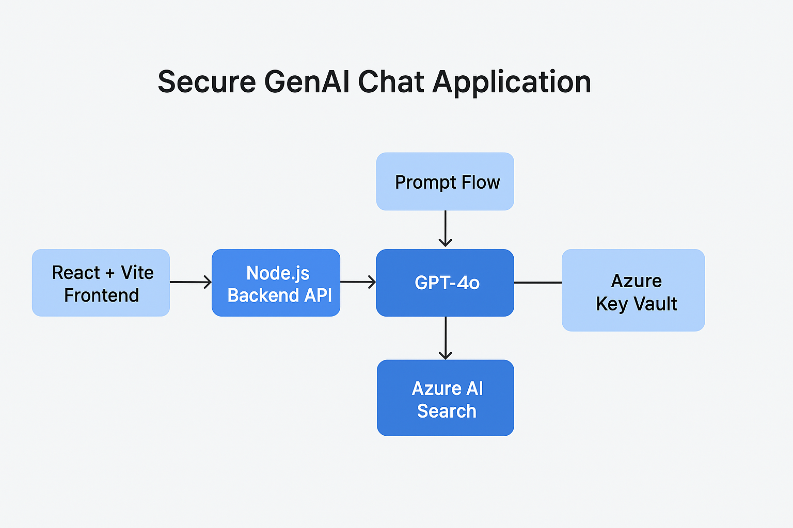

# 🚀 Demo-Secure-GenAI-Chat-Application

A **secure GenAI-powered Chat Application** built on **Azure OpenAI GPT-4o** with **RAG (Retrieval-Augmented Generation)** and **Prompt Flow** for orchestration.
The app ensures **enterprise-grade security** using **Azure Key Vault** and is deployed on **Azure App Service** with a **React + Vite frontend** and **Node.js/TypeScript backend API**.


---

## 📂 Project Structure

```
📦Demo-Secure-GenAI-Chat-Application
┣ 📂Screenshots                    # Deployment and working demo screenshots
┃ ┣ 📜Deployed Model Using Prompt Flow.png
┃ ┣ 📜Models.png
┃ ┣ 📜Prompt Flow Graph.png
┃ ┣ 📜rag-context-Injection.png
┃ ┣ 📜RAG.png
┃ ┗ 📜Working User Interface.png
┣ 📂secure-ai-chat                 # React + Vite frontend
┃ ┣ 📂src
┃ ┃ ┣ 📜App.tsx
┃ ┃ ┣ 📜main.tsx
┃ ┃ ┗ 📜App.css
┃ ┣ 📜package.json
┃ ┗ 📜vite.config.ts
┗ 📂secure-ai-chat-api             # Node.js/TypeScript backend API
  ┣ 📂src
  ┃ ┗ 📜index.ts
  ┣ 📜package.json
  ┗ 📜tsconfig.json
```

---

## ⚙️ Features

- 🔒 **Secure Deployment** with Azure Key Vault for managing secrets
- 🧠 **RAG with Azure AI Search**: GPT-4o responses are **grounded on enterprise data** indexed in Azure AI Search (vector index)
- 🔄 **Prompt Flow Orchestration**: Handles retrieval + context injection from AI Search into GPT-4o prompts
- 🌐 **React + Vite Frontend** with chat-style UI
- ⚡ **Node.js/TypeScript Backend** connecting frontend to AI services
- ☁️ **Azure App Service Hosting** with Managed Identity

---

## 🚀 Setup & Run Locally

### 1️⃣ Clone the Repo

```bash
git clone https://github.com/<your-username>/Demo-Secure-GenAI-Chat-Application.git
cd Demo-Secure-GenAI-Chat-Application
```

### 2️⃣ Install Dependencies

**Frontend (secure-ai-chat):**

```bash
cd secure-ai-chat
npm install
npm run dev   # runs on http://localhost:5173
```

**Backend (secure-ai-chat-api):**

```bash
cd secure-ai-chat-api
npm install
npm run start   # runs on http://localhost:3000
```

### 3️⃣ Environment Variables

Create a `.env` file in both `secure-ai-chat` and `secure-ai-chat-api` with the following (or fetch from Azure Key Vault in production):

```env
AI_ENDPOINT=<your-azure-openai-endpoint>
AI_KEY=<your-azure-openai-key>
AI_SEARCH_ENDPOINT=<your-ai-search-endpoint>
AI_SEARCH_KEY=<your-ai-search-key>
AI_SEARCH_INDEX_NAME=<your-index-name>
```

---

## ☁️ Azure Deployment Steps

### 1. Provision Services

- **Azure OpenAI** (GPT-4o)
- **Azure AI Search** (Vector Index)
- **Azure Key Vault** (for secrets)
- **Azure App Service** (Web App + API)

### 2. Configure Key Vault

- Add secrets: `AI_ENDPOINT`, `AI_KEY`, `AI_SEARCH_ENDPOINT`, `AI_SEARCH_KEY`, etc.
- Assign **Managed Identity** to App Service
- Grant App Service **Key Vault Secrets User** role

### 3. Deploy

- Deploy `secure-ai-chat` frontend to App Service (or Static Web Apps)
- Deploy `secure-ai-chat-api` backend to App Service
- Configure environment variables to load from Key Vault

---

## 📸 Screenshots

### Prompt Flow Graph
The orchestration workflow showing how user queries are processed through Azure AI Search retrieval and GPT-4o generation.

### RAG Context Injection
Demonstrates how Azure AI Search results are injected into GPT-4o prompts for grounding responses on enterprise data.

### Working Chat UI
Live demonstration of the chat interface with secure, context-aware AI responses.

---

## 🎯 Use Cases

- **Enterprise Secure Chatbot** (grounded on private company docs)
- **Knowledge Assistant** (internal policies, manuals, SOPs)
- **AI Support Desk** with data privacy

---

## 🛡️ Security Features

- **Azure Key Vault Integration**: All secrets and API keys stored securely
- **Managed Identity**: No hardcoded credentials in code
- **Private Data Grounding**: RAG ensures responses are based on your enterprise data
- **HTTPS Enforcement**: Secure communication between frontend and backend

---

## 🔧 Technology Stack

### Frontend
- React 18
- TypeScript
- Vite
- Modern CSS

### Backend
- Node.js
- TypeScript
- Express.js
- Azure SDK

### Azure Services
- Azure OpenAI (GPT-4o)
- Azure AI Search
- Azure Key Vault
- Azure App Service
- Prompt Flow

---

## 📝 API Endpoints

### POST /api/chat
Send a chat message and receive AI-generated response.

**Request:**
```json
{
  "message": "What is our company policy on remote work?"
}
```

**Response:**
```json
{
  "response": "Based on company documentation...",
  "sources": ["policy-doc-1", "policy-doc-2"]
}
```

---

## 🤝 Contributing

Contributions are welcome! Please feel free to submit a Pull Request.

1. Fork the repository
2. Create your feature branch (`git checkout -b feature/AmazingFeature`)
3. Commit your changes (`git commit -m 'Add some AmazingFeature'`)
4. Push to the branch (`git push origin feature/AmazingFeature`)
5. Open a Pull Request

---

## 📄 License

This project is licensed under the MIT License - see the LICENSE file for details.

---

## 👤 Author

**Sriharsha Neerukodna**

- 🔗 [GitHub Portfolio](https://github.com/Sriharsha9436)
- 💼 Azure Cloud & DevOps Engineer | AI Solutions


