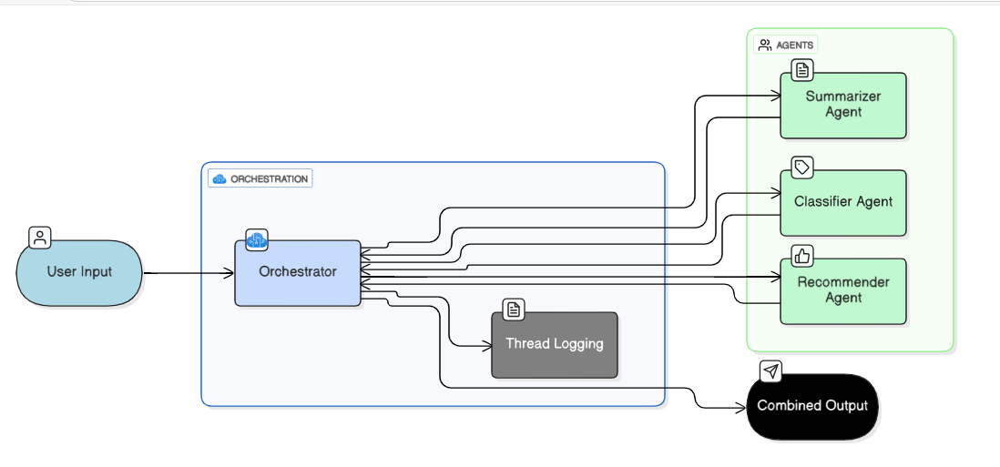

# Multi-Agent Orchestration Demo

This repository demonstrates a multi-agent orchestration system using Azure AI Foundry GPT-4o Mini. The system orchestrates three agents: Summarizer, Classifier, and Recommender. Users can input queries, and the system generates a summary, classifies the input, and provides actionable recommendations.



## 📂 Folder Structure

```
multi-agent-orchestration/
 ┣ agents/
 ┃ ┣ classifier.py
 ┃ ┣ recommender.py
 ┃ ┣ summarizer.py
 ┃ ┗ __init__.py
 ┣ assets/
 ┃ ┗ flow_diagram.png
 ┣ orchestration/
 ┃ ┣ sequential_orchestrator.py
 ┃ ┗ __init__.py
 ┣ utils/
 ┃ ┣ logger.py
 ┃ ┣ thread_client.py
 ┃ ┗ __init__.py
 ┣ Thread Log/
 ┃ ┗ thread_thread_<id>.txt
 ┣ .env
 ┣ app.py          # Streamlit UI
 ┣ config.py
 ┣ main.py
 ┣ requirements.txt
```

## ⚡ Features

- Multi-agent orchestration using GPT-4o Mini in Azure AI Foundry
- Dynamic user queries
- Stores conversation threads in Thread Log folder
- Streamlit UI for visualizing thread logs and results
- Ready for local testing or deployment to Azure App Service

## 🔧 Setup & Installation

### Clone the repository

```bash
git clone <repo-url>
cd multi-agent-orchestration
```

### Create a virtual environment

```bash
python -m venv .venv
.venv\Scripts\activate   # Windows
source .venv/bin/activate # Linux/Mac
```

### Install requirements

```bash
pip install -r requirements.txt
```

### Create a .env file

Create a `.env` file in the root directory with your Azure AI Foundry details:

```
PROJECT_ENDPOINT=<your-project-endpoint>
AI_FOUNDRY_AGENT_ID=<your-agent-id>
```

## 🏃 Running the Orchestration Locally

### Using Terminal

```bash
python main.py
```

- Enter your query when prompted
- Results will show Summary, Classification, and Recommendation
- Thread logs are stored in the Thread Log folder

### Using Streamlit UI

```bash
streamlit run app.py
```

- Enter your query in the text area
- View orchestration results and full conversation thread in a scrollable interface

## 🔐 Using Azure Key Vault (Optional)

Instead of storing sensitive values in `.env`, you can store them in Azure Key Vault:

### 1. Create a Key Vault in Azure

### 2. Add secrets

- `PROJECT_ENDPOINT`
- `AI_FOUNDRY_AGENT_ID`

### 3. Update config.py to fetch from Key Vault

```python
from azure.identity import DefaultAzureCredential
from azure.keyvault.secrets import SecretClient
import os

KEY_VAULT_URL = os.environ.get("KEY_VAULT_URL")
credential = DefaultAzureCredential()
client = SecretClient(vault_url=KEY_VAULT_URL, credential=credential)

PROJECT_ENDPOINT = client.get_secret("PROJECT_ENDPOINT").value
AI_FOUNDRY_AGENT_ID = client.get_secret("AI_FOUNDRY_AGENT_ID").value
```

Now the code fetches secrets securely from Key Vault.

## 📖 How It Works

1. User enters a query
2. ThreadClient creates a thread in Azure AI Foundry
3. Agents (Summarizer, Classifier, Recommender) process the query sequentially:
   - **Summarizer**: Summarizes text
   - **Classifier**: Categorizes input
   - **Recommender**: Provides actionable suggestions
4. Thread logs store all messages as proof
5. Results are displayed in terminal or Streamlit UI

## 📝 Notes

- GPT model used: GPT-4o Mini
- Thread logs are stored in Thread Log folder
- Streamlit UI provides a better interface than terminal logs
- You can deploy this repo to Azure App Service, using Key Vault for secure secret management

## 📦 Dependencies

See `requirements.txt`:

```
azure-identity
azure-ai-agents
streamlit
python-dotenv
```

## 🚀 Deployment

This application can be deployed to Azure App Service. Ensure you configure the following:

- Set environment variables or use Azure Key Vault for secrets
- Configure Python runtime
- Set startup command: `streamlit run app.py` (for Streamlit) or `python main.py` (for CLI)

## 📄 License

This project is provided as-is for demonstration purposes.

## 🤝 Contributing

Contributions, issues, and feature requests are welcome!

## 📧 Support

For questions or support, please open an issue in the repository.
